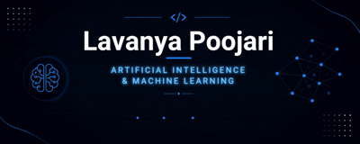

  

---

## 👩‍💻 About Me

🎓 B.E. in Artificial Intelligence & Machine Learning (2023–2027)

📍 Bhiwandi, Maharashtra, India

💡 Passionate about Artificial Intelligence, Machine Learning, Deep Learning and Full-Stack Development.

🚀 Currently building real-world AI solutions and contributing to Open Source.

🌱 Currently learning

- Machine Learning
- Deep Learning
- Computer Vision
- NLP
- React
- Firebase
- Flask

---

# 🛠 Tech Stack

### Languages

### Frontend

### Backend

### AI / ML

### Tools

---

# 🚀 Featured Projects

| Project | Description |
|---------|-------------|
| 🌐 CSSB Website | Modern React + Tailwind website |
| 📚 100DaysOfCoding | Daily coding journey |

---

# 🔥 GitHub Streak

---

# 📊 Contribution Graph

---

# 📫 Connect With Me

---

### 💙 "Learning every day. Building for tomorrow." 💙 

